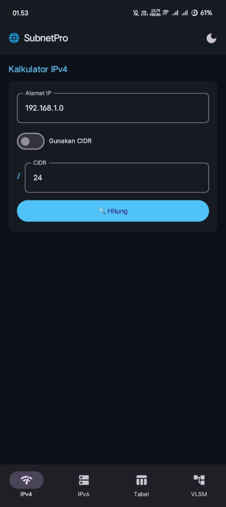
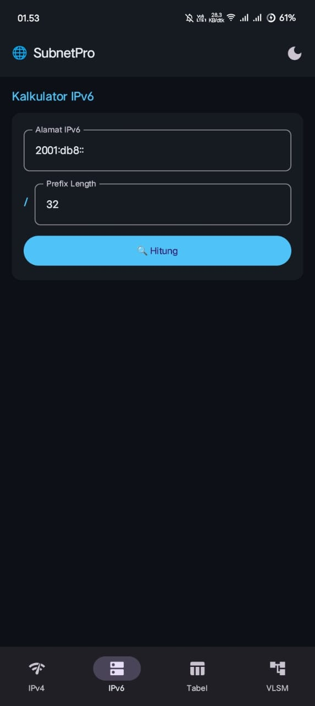
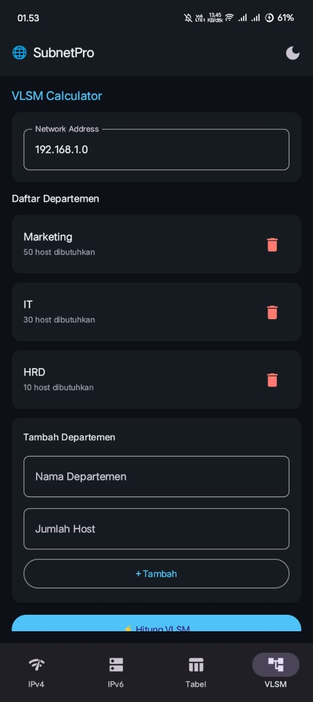
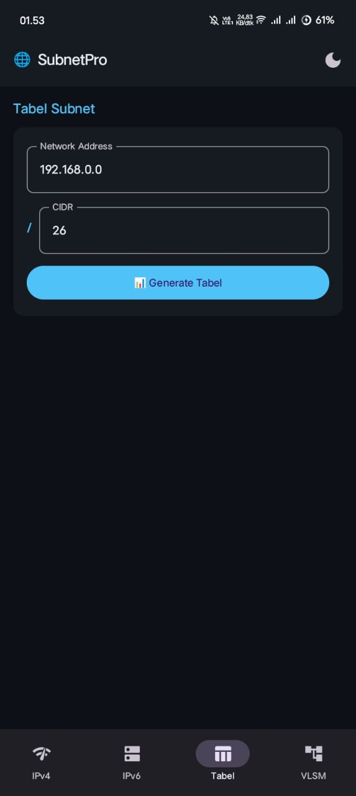

<div align="center">

# 🌐 SubnetPro

### Kalkulator Subnetting Profesional untuk Android


</div>

---

## 📱 Tentang Aplikasi

**SubnetPro** adalah aplikasi Android kalkulator subnetting yang lengkap dan mudah digunakan. Dibangun dengan **Jetpack Compose** dan **Material3**, aplikasi ini mendukung kalkulasi IPv4, IPv6, Subnet Table, dan VLSM dalam satu aplikasi.

---

## ✨ Fitur Utama

### 🔵 IPv4 Subnet Calculator
- Input IP Address dengan CIDR atau Subnet Mask
- Hitung Network Address & Broadcast Address
- Hitung Subnet Mask & Wildcard Mask
- CIDR Notation
- Host Range (First & Last Host)
- Jumlah host yang tersedia
- Deteksi Kelas IP (A/B/C/D/E)
- Deteksi Tipe IP (Public/Private/Loopback)
- Representasi Biner

### 🟣 IPv6 Subnet Calculator
- Input IPv6 Address + Prefix Length
- Network Address (Full & Compressed)
- Host Range
- Total jumlah host

### 📊 Subnet Table
- Generate tabel semua subnet dalam sebuah network
- Tampilkan Network, Broadcast, Host Range per subnet
- Mendukung semua CIDR /0 hingga /32

### ⚡ VLSM Calculator
- Input kebutuhan host per departemen
- Alokasi subnet optimal secara otomatis
- Tambah/hapus departemen secara dinamis
- Urutan alokasi dari kebutuhan terbesar

### 🎨 Tema
- Dark Mode
- Light Mode
- Auto (mengikuti sistem HP)
- Preferensi tersimpan secara permanen

---

## 🛠️ Teknologi

| Komponen | Versi |
|----------|-------|
| Language | Kotlin 2.0.21 |
| UI Framework | Jetpack Compose |
| Compose BOM | 2024.12.01 |
| Material | Material3 |
| Min SDK | 26 (Android 8.0) |
| Target SDK | 35 |
| AGP | 8.7.3 |
| DataStore | Preferences DataStore |

---

## 📂 Struktur Project

```
SubnetPro/
├── app/src/main/java/com/example/subnetpro/
│   ├── MainActivity.kt          # UI utama + navigasi + theme
│   ├── SubnetCalculator.kt      # Logika IPv4, IPv6, VLSM
│   └── ThemePreference.kt       # Simpan preferensi tema
├── app/src/main/res/
│   └── values/themes.xml        # Base theme
└── app/build.gradle.kts         # Konfigurasi build
```

---

## 🚀 Cara Build

### Prasyarat
- Android Studio Hedgehog atau lebih baru
- JDK 11+
- Android SDK 35

### Clone & Build
```bash
# Clone repository
git clone https://github.com/SerpentSecHunter/SubnetPro.git
cd SubnetPro

# Build debug APK
.\gradlew app:assembleDebug

# Install ke device
.\gradlew app:installDebug
```

### APK Output
```
app/build/outputs/apk/debug/app-debug.apk
```

---

## 📖 Cara Penggunaan

### IPv4
1. Buka tab **IPv4**
2. Masukkan IP Address (contoh: `192.168.1.0`)
3. Pilih CIDR (contoh: `24`) atau aktifkan toggle untuk input Subnet Mask
4. Klik **🔍 Hitung**
5. Lihat hasil lengkap termasuk representasi biner

### IPv6
1. Buka tab **IPv6**
2. Masukkan IPv6 Address (contoh: `2001:db8::`)
3. Masukkan Prefix Length (contoh: `32`)
4. Klik **🔍 Hitung**

### Subnet Table
1. Buka tab **Tabel**
2. Masukkan Network Address
3. Masukkan CIDR
4. Klik **📊 Generate Tabel**
5. Scroll untuk lihat semua subnet

### VLSM
1. Buka tab **VLSM**
2. Masukkan Network Address
3. Tambahkan departemen dengan nama dan jumlah host
4. Klik **⚡ Hitung VLSM**
5. Lihat alokasi subnet optimal per departemen

---

## 📸 Tangkapan Layar

<div align="center">
  <table>
    <tr>
      <td></td>
      <td></td>
      <td></td>
    </tr>
    <tr>
      <td align="center"><b>IPv4 Calculator</b></td>
      <td align="center"><b>IPv6 Calculator</b></td>
      <td align="center"><b>VLSM Calculator</b></td>
    </tr>
    <tr>
      <td></td>
      <td></td>
      <td></td>
    </tr>
    <tr>
      <td align="center"><b>Subnet Table</b></td>
      <td></td>
      <td></td>
    </tr>
  </table>
</div>

---

## 🤝 Kontribusi

1. Fork repository ini
2. Buat branch fitur baru (`git checkout -b fitur/NamaFitur`)
3. Commit perubahan (`git commit -m 'Tambah fitur X'`)
4. Push ke branch (`git push origin fitur/NamaFitur`)
5. Buat Pull Request

---

## 📄 Lisensi

```
MIT License

Copyright (c) 2026 Ade Pratama

Permission is hereby granted, free of charge, to any person obtaining a copy
of this software and associated documentation files (the "Software"), to deal
in the Software without restriction, including without limitation the rights
to use, copy, modify, merge, publish, distribute, sublicense, and/or sell
copies of the Software, and to permit persons to whom the Software is
furnished to do so, subject to the following conditions:

The above copyright notice and this permission notice shall be included in all
copies or substantial portions of the Software.

THE SOFTWARE IS PROVIDED "AS IS", WITHOUT WARRANTY OF ANY KIND, EXPRESS OR
IMPLIED, INCLUDING BUT NOT LIMITED TO THE WARRANTIES OF MERCHANTABILITY,
FITNESS FOR A PARTICULAR PURPOSE AND NONINFRINGEMENT. IN NO EVENT SHALL THE
AUTHORS OR COPYRIGHT HOLDERS BE LIABLE FOR ANY CLAIM, DAMAGES OR OTHER
LIABILITY, WHETHER IN AN ACTION OF CONTRACT, TORT OR OTHERWISE, ARISING FROM,
OUT OF OR IN CONNECTION WITH THE SOFTWARE OR THE USE OR OTHER DEALINGS IN THE
SOFTWARE.
```

---

## 👨‍💻 Developer

| | |
|---|---|
| **Nama** | Ade Pratama |
| **Email** | luarnegriakun702@gmail.com |

Dibuat dengan ❤️ menggunakan **Kotlin** + **Jetpack Compose**

---

## © Hak Cipta

```
Copyright (c) 2026 Ade Pratama
Email: luarnegriakun702@gmail.com

Seluruh hak cipta dilindungi undang-undang.
Dilarang menyalin, mendistribusikan, atau memodifikasi
aplikasi ini tanpa izin tertulis dari pengembang.

All rights reserved.
```

---

<div align="center">
⭐ Jika aplikasi ini bermanfaat, jangan lupa beri bintang di GitHub!<br><br>
© 2026 <b>Ade Pratama</b> · luarnegriakun702@gmail.com
</div>